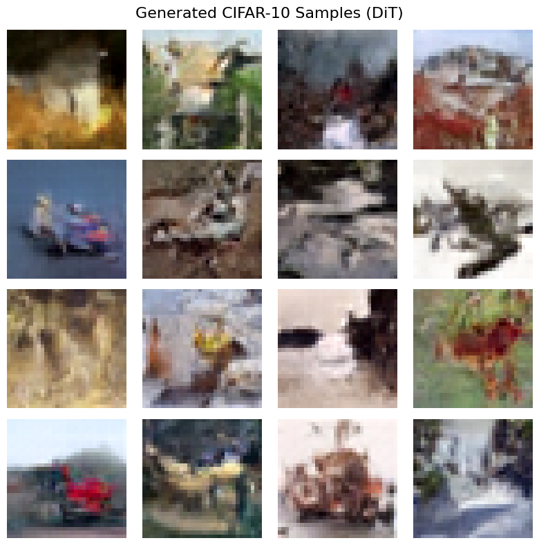
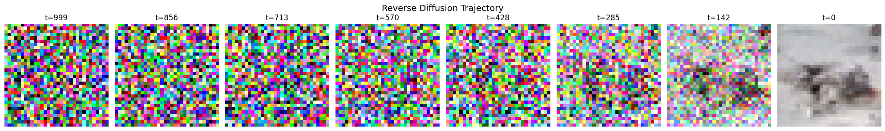
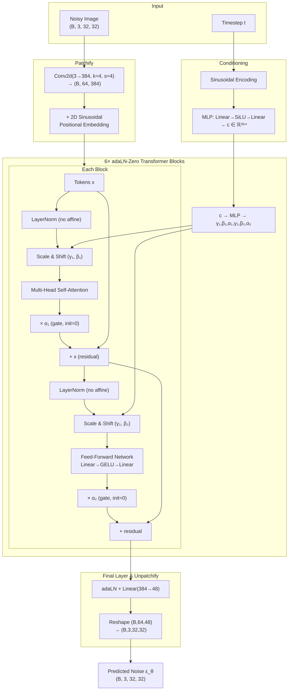
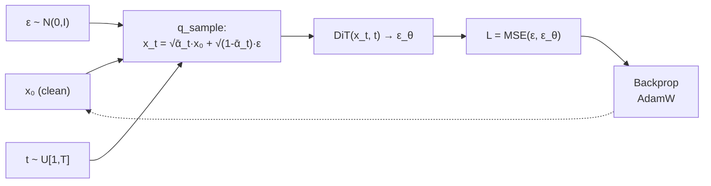
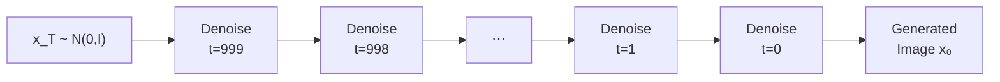

# Diffusion Transformer (DiT) from Scratch — CIFAR-10

A from-scratch **Micro Diffusion Transformer (DiT)** trained in pixel space on CIFAR-10 (32×32×3). No pre-trained VAE — pure pixel-level diffusion with a transformer backbone.

| Spec | Value |
|---|---|
| Dataset | CIFAR-10 (50k images, 32×32×3) |
| Patch size | 4×4 → **64 tokens** |
| Hidden dim | 384 |
| Attention heads | 6 |
| Transformer blocks | 6 (adaLN-Zero) |
| Parameters | ~30M |
| Diffusion steps | T = 1000 (linear β schedule) |
| Loss | MSE (ε-prediction) |

---

## Results

### Generated Samples

<p align="center">
  
</p>

### Reverse Diffusion Trajectory

<p align="center">
  
</p>

---

## Architecture Overview



### Training Loop



### Sampling (Reverse Diffusion)



$$x_{t-1} = \frac{1}{\sqrt{\alpha_t}} \left( x_t - \frac{\beta_t}{\sqrt{1 - \bar{\alpha}_t}} \cdot \varepsilon_\theta(x_t, t) \right) + \sigma_t \cdot z$$

---

## How to Run

1. Open `DiT.ipynb` in **Google Colab**
2. Set runtime to **T4 GPU** (`Runtime → Change runtime type → T4`)
3. Click **Run All**
4. Training runs for ~80 epochs with checkpoints every 10
5. After training, sampling cells generate a 4×4 grid of images

---

## Project Structure

```
DiT-from-Scratch/
├── DiT.ipynb              # Complete notebook (all 4 phases)
├── README.MD              # This file
├── assets/                # Result images
├── dit_epoch_80.pt        # Trained model weights
└── cifar-10-batches-py/   # CIFAR-10 dataset (auto-downloaded)
```

---

## References

- [Scalable Diffusion Models with Transformers (DiT)](https://arxiv.org/abs/2212.09748) — Peebles & Xie, 2023
- [Denoising Diffusion Probabilistic Models (DDPM)](https://arxiv.org/abs/2006.11239) — Ho et al., 2020
- [An Image is Worth 16x16 Words (ViT)](https://arxiv.org/abs/2010.11929) — Dosovitskiy et al., 2021
