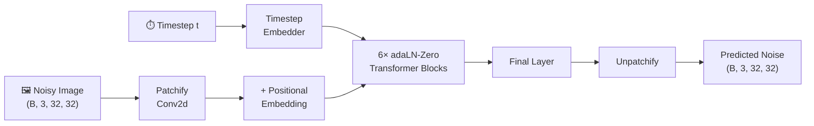
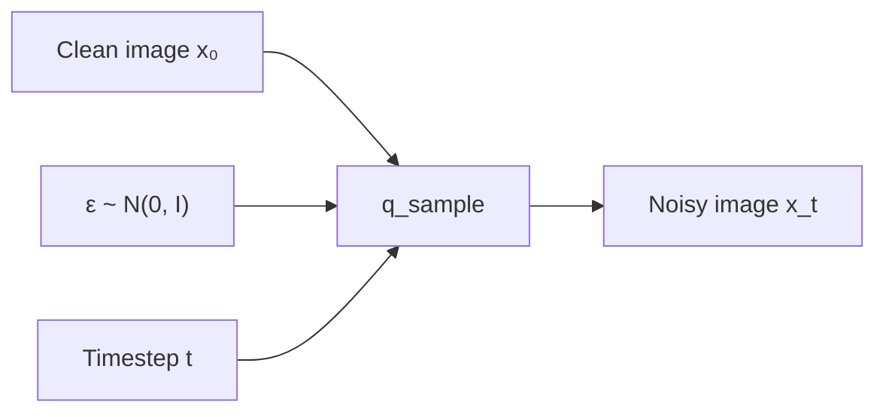
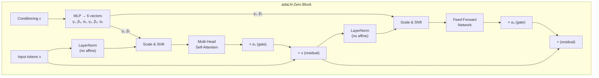
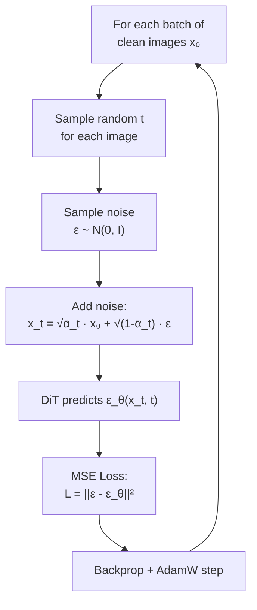
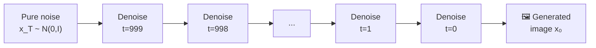

#  Diffusion Transformer (DiT) from Scratch — CIFAR-10

A complete, from-scratch implementation of a **Micro Diffusion Transformer (DiT)** trained directly in pixel space on CIFAR-10 (32×32×3). No pre-trained VAE — pure pixel-level diffusion with a transformer backbone.

| Spec | Value |
|---|---|
| Dataset | CIFAR-10 (50k images, 32×32×3) |
| Patch size | 4×4 → **64 tokens** |
| Hidden dim | 384 |
| Attention heads | 6 |
| Transformer blocks | 6 (adaLN-Zero) |
| Parameters | ~30M |
| Diffusion steps | T = 1000 (linear β schedule) |
| Loss | MSE (noise prediction / ε-prediction) |

---

## High-Level Architecture



---

## Phase 1 — Data Preparation & Forward Diffusion

### Loading CIFAR-10

The dataset is loaded via `torchvision.datasets.CIFAR10` and normalised from the standard `[0, 255]` range to `[-1, 1]` using:

```
transforms.Normalize((0.5, 0.5, 0.5), (0.5, 0.5, 0.5))
```

This centers pixel values around zero, which is ideal for diffusion models that start and end with Gaussian-distributed data.

### The DDPM Variance Schedule

A **linear β schedule** defines how much noise is added at each of the `T = 1000` timesteps:

$$\beta_t \in [\beta_{\text{start}}, \beta_{\text{end}}] = [10^{-4},\ 0.02]$$

From β we pre-compute cumulative products:

$$\alpha_t = 1 - \beta_t \qquad \bar{\alpha}_t = \prod_{s=1}^{t} \alpha_s$$

### The Forward Process

Given a clean image $x_0$, we can jump directly to any noise level $t$ in closed form:

$$q(x_t | x_0) = \mathcal{N}\left(x_t;\ \sqrt{\bar{\alpha}_t}\, x_0,\ (1 - \bar{\alpha}_t)\, \mathbf{I}\right)$$

Which means:

$$x_t = \sqrt{\bar{\alpha}_t} \cdot x_0 + \sqrt{1 - \bar{\alpha}_t} \cdot \varepsilon, \quad \varepsilon \sim \mathcal{N}(0, \mathbf{I})$$



---

## Phase 2 — The Micro-DiT Architecture

### 1. Patchification

A single `nn.Conv2d(3, 384, kernel_size=4, stride=4)` slices the 32×32 image into a grid of **8×8 = 64 non-overlapping patches**, each projected to 384 dimensions. This is equivalent to ViT-style patchification but implemented efficiently as a convolution.

```
Input:  (B, 3, 32, 32)
         ↓ Conv2d(3→384, k=4, s=4)
Output: (B, 384, 8, 8)
         ↓ flatten + transpose
Tokens: (B, 64, 384)
```

### 2. 2D Sine-Cosine Positional Embeddings

Standard **fixed** (non-learned) 2D sinusoidal positional embeddings encode each patch's `(row, col)` position in the 8×8 grid. Each spatial dimension gets half the embedding dimensions, using sine and cosine at different frequencies — identical to the method used in the original ViT and DiT papers.

### 3. Timestep Embedding

The scalar timestep `t` is converted to a dense conditioning vector via:

1. **Sinusoidal encoding** (same idea as transformer positional encoding, but for the scalar `t`)
2. **Two-layer MLP**: `Linear(256→384) → SiLU → Linear(384→384)`

This produces a single vector `c ∈ ℝ³⁸⁴` that conditions every transformer block.

### 4. adaLN-Zero Transformer Blocks

The core innovation of DiT. Instead of standard LayerNorm, each block uses **Adaptive Layer Norm** where the timestep embedding modulates the normalisation:



**The "Zero" trick**: All gate parameters (α₁, α₂) are **initialised to zero**. This means at the start of training, each block acts as an **identity function** — the output equals the input. This provides massive training stability, as the model starts from a known good state and gradually learns to denoise.

The modulation math:

$$\text{modulate}(x, \beta, \gamma) = (1 + \gamma) \cdot \text{LayerNorm}(x) + \beta$$

### 5. The Decoder (Unpatchify)

The `FinalLayer` applies one last adaLN modulation, then a linear projection maps each token back to `4×4×3 = 48` values. The 64 tokens are then reshaped back into a full `32×32×3` image:

```
Tokens:  (B, 64, 384)
          ↓ FinalLayer (adaLN + Linear → 48)
Patches: (B, 64, 48)
          ↓ reshape to (B, 8, 8, 4, 4, 3)
          ↓ permute + reshape
Image:   (B, 3, 32, 32)
```

---

## Phase 3 — Training Loop



- **Optimizer**: AdamW (lr = 1e-4)
- **Epochs**: 80 (with checkpoints every 10)
- **Batch size**: 128
- **Loss**: Simple MSE between the actual noise ε added and the noise ε_θ predicted by the DiT

---

## Phase 4 — Sampling (Reverse Diffusion)

To generate images, we run the learned denoising process **backward** from `t = T-1` down to `t = 0`:



At each step, the DDPM reverse formula computes:

$$\mu_\theta(x_t, t) = \frac{1}{\sqrt{\alpha_t}} \left( x_t - \frac{\beta_t}{\sqrt{1 - \bar{\alpha}_t}} \cdot \varepsilon_\theta(x_t, t) \right)$$

$$x_{t-1} = \mu_\theta + \sigma_t \cdot z, \quad z \sim \mathcal{N}(0, \mathbf{I}) \text{ for } t > 0$$

At `t = 0`, no noise is added — the mean is the final output.

The generated tensors are un-normalised from `[-1, 1]` back to `[0, 1]` for display.

---

## How to Run

1. Open `DiT.ipynb` in **Google Colab**
2. Set runtime to **T4 GPU** (`Runtime → Change runtime type → T4`)
3. Click **Run All**
4. Training runs for ~80 epochs with checkpoints saved every 10
5. After training, the sampling cells generate and display a 4×4 grid of AI-generated images

---

## Project Structure

```
DiT-from-Scratch/
├── DiT.ipynb              # Complete notebook (all 4 phases)
├── README.MD              # This file
├── checkpoints/           # Saved model weights (created during training)
└── data/                  # CIFAR-10 dataset (auto-downloaded)
```

---

## References

- [Scalable Diffusion Models with Transformers (DiT)](https://arxiv.org/abs/2212.09748) — Peebles & Xie, 2023
- [Denoising Diffusion Probabilistic Models (DDPM)](https://arxiv.org/abs/2006.11239) — Ho et al., 2020
- [An Image is Worth 16x16 Words (ViT)](https://arxiv.org/abs/2010.11929) — Dosovitskiy et al., 2021
